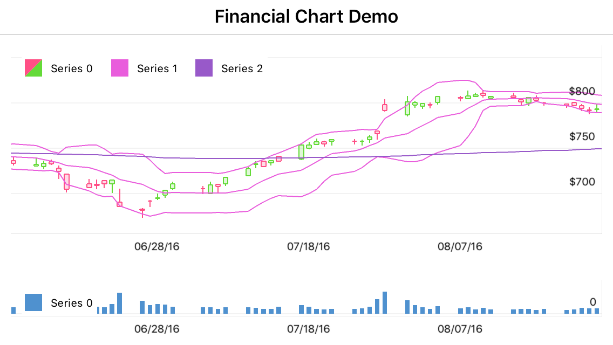

<!-- default badges list -->

<!-- default badges end -->
# Xamarin.Forms Financial Chart Example
This example demonstrates how to use DevExpress Charts for Xamarin.Forms to show financial data:

The __Moving Average__ and __Bollinger Bands__ series represent Calculated Series that visualize data points whose values are calculated by specified series' data points.
Also, note that two charts are scrolled synchronously, because their X-axes use the same __synchronizer__ object.

> - Start to learn the example from the [MainPage.xaml](CS/FinancialChartExample/MainPage.xaml) file.
> - You need to add binaries to run the example. Refer to the [Native Chart Controls for iOS, Android and Xamarin - v1.1 CTP Release Notes](https://www.devexpress.com/Support/Center/Question/Details/T671818/native-chart-controls-for-ios-android-and-xamarin-v1-1-release-notes) Knowledge Base article to learn how to do this.
